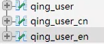

## 1.模型的定义

模式是用于对数据库进行操作的组件

数据库配置文件中配置了数据库连接信息前提下，模型会自动对应数据表，模型类的命名规则是除去表前缀的数据表名称，如果数据表名称为luo_user（假设数据库的前缀定义是 luo_）,则模型的名称为User(因此用模型User就能访问luo_user数据表)

在`app/model/User.php`定义一个User模型,默认连接luo_user数据表
```php
<?php
namespace app\model;

use think\Model;

class User extends Model
{
    ...
}
```
### 指定数据表甚至数据库连接
```php
namespace app\model;

use think\Model;

class User extends Model
{
    // 设置当前模型对应的完整数据表名称
    protected $table = 'think_user';
    
    // 设置当前模型的数据库连接
    protected $connection = 'db_config';
}

```
### 通过后缀访问
> 用于多语言或者数据分表的模型查询

数据库添加含有后缀数据表



定义默认后缀
```php
<?php
namespace app\model;

use think\Model;

class Blog extends Model
{
    // 定义默认的表后缀（默认查询中文数据）
    protected $suffix = _cn';
}
```
使用suffix和setSuffix动态切换模型

`\app\index\controller\Index.php`下
```php
// suffix方法用于静态查询
$blog = Blog::suffix('_en')->find();
$blog->name = 'test';
$blog->save();

// setSuffix用于动态设置
$blog = new Blog($data);
$blog->setSuffix('_en')->save();
```
## 2.使用

`\app\index\controller\Index.php`下

```php
namespace app\index\controller;
use app\BaseController;
use think\facade\Db;
// 引入模型
use app\model\User;

class Index extends BaseController
{
    public function index()
    {
        // 1.创建$UserModel实例后使用实例 

        $userModel = new UserModel();
        $res=$userModel::where('id','>',10)->select();

        // 2.直接使用User

        $res= User::where('id','>',10)->select();

        // $res为数据对象

        //3.输出数据

        $user = User::find(1);
        echo $user->create_time;  
        echo $user->name;
        //当成数组使用
        $user = User::find(1);
        echo $user['create_time'];  
        echo $user['name'];

    }
}
```
### 在模型内部获取数据
`app/model/User`
```php
    namespace app\model;
    use think\Model;
    class User extends Model
    {
        public function a(){
            echo "模型内部<br>";
            $user = $this->find(1);
            echo $user->getAttr('create_time');  
            echo $user->getAttr('name');
        }
    }
```
`\app\index\controller\Index.php`
```php
class Index extends BaseController
{
 public function Index()
    {
        $User = new User();
        $User->a();
    }
}
```

其他的使用模型对数据库的增删改查和使用DB类差距不大，具体查文档。